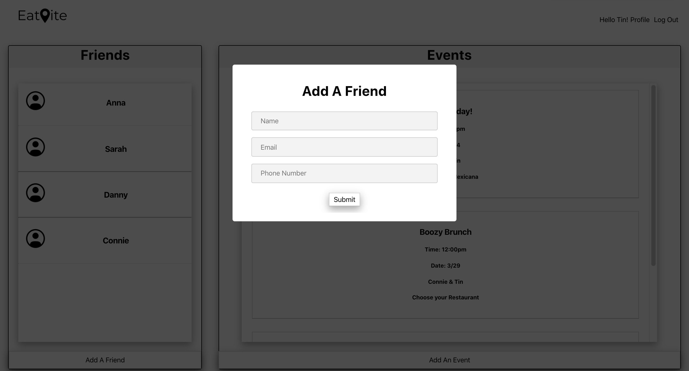

# EatVite
The Quarantined Devs
would like to cordially (and from at least 6 feet away) invite you to EatVite, an app where indecisive foodie friends can go to help eachother pick a restaurant for their upcoming date.

## Our Site
 

## Technologies
- MongoDB 
- Mongoose
- Express
- React
- React Router Dom
- Axios
- JWT
- CSS

## Our Approach
Our ideals high and feeling invicible we put our heads together and dreamed of an tinder like app, that allowed us to swipe left at restaurants we didn't like and swipe right to share our ideas for a dinner date with a friend. 

Scope, and our instructors asked us to plant ourselves in a more realistic website, and thus our current project was born. 

## How To Use EatVite
Begin by signing up on the homepage with your name, email, and password. Once you are logged in, you can then start by adding a friend whom you'd like to send the EatVite to by clicking on *Add A Friend* on the bottom of your *Friends* list. Once you have decided on who you're going to eat with, you can then click on *Create An Eatvite* under *Events*, this will then take you to a form where you can fill out who you'll be dining with, when this event will take place, and allow you to choose up to 5 restaurants to send off to your friend. Lastly, as your friend logs onto their account, they will be able to see the EatVite that you have just sent and be asked to choose ONE restaurant from the list. And there you have it, a decision is made, **Bon Apetite!**

## User Story 
We are targeting the indecisive individuals who take so long to decide on where to eat that they end up drinking water for lunch. The ones who have friends that say, "Anything is fine" but say no to every choice given to them. WHAT DO YOU WANT TO EAT?! 

Our frustrated users will want a way to be able to choose only a handful of restaurants and *force* their friend to make a decision, once and for all. 

Why? Because ain't nobody got time for that.

## Wireframes

## Unsolved Problems && Major Hurdles

The first two sprints of this project went really well. Planning and stubbing out the front and back end, while providing their own minor blockers, went pretty smoothly. 

Once we hit sprint three where the bulk of setState and fetching to the backend needed to be implemented we hit a major hurdle...to axios or to fetch. Also, how do we continue to pass the user token from page to page? And why does cors hate us?! 

## Stretch Goals

- Add React Spring (this will add swipe capabilities & look cool)
- Send EatVites to multiple users (not just two)
- Be able to add friends from your social media platforms

